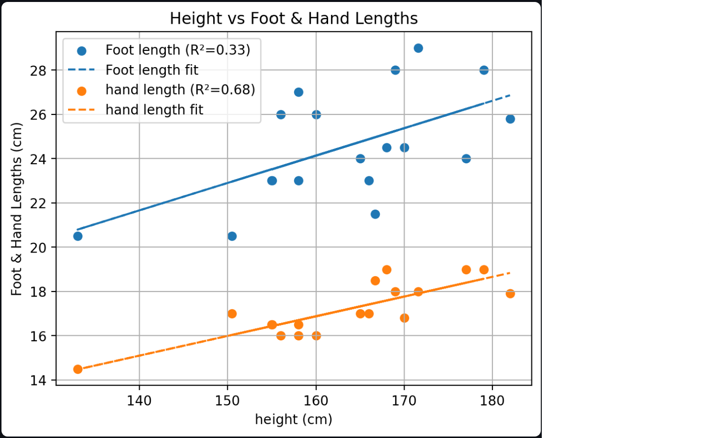

# Graphing Tool

This is a simple, interactive graphing tool built with Python and Streamlit. It allows users to import tabular data (e.g., Excel), select X and Y columns, and generate graphical visualizations, including scatter plot with fitted lines, and linear regression analysis (e.g., R square statistical measurement). 

####

This is a lightweight, interactive graphing application built with Python and Streamlit. It is designed to help users:

- **Import tabular data (e.g., Excel or CSV files)**

- **Select X and Y columns for analysis**

- **Visualize data through scatter plots**

- **Fit a linear regression line to the data**

- **Display regression statistics, including the R² value**

The tool is ideal for quick data exploration, teaching data analysis concepts, or creating visuals from experimental data.

## 🖼️ Screenshot


## Installation
### Prerequisites

- **Python 3.7+**
- **pip** (usually comes with Python)
- **(Optional) A virtual environmental tool such as `venv` or `conda`**
  
### Setup

  1. **Clone the repository**
      ```bash
      git clone https://github.com/your-username/Graphing_Tool.git
      cd Graphing_Tool
  2. Create & activate a virtual environment (recommended)
     - Using venv:
      ```bash
          python3 -m  venv .venv
          source .venv/bin/activate   # macOS/Linux
          .venv\Scripts\activate.bat  # Windows
      ```
     - Or using conda 
      ```bash
          conda create -n graph-tool python=3.8
          conda activate graph-tool
      ```
  3. Install dependencies
      ```bash
          pip install -r requirements.txt
      ```
  4. Run the app
      ```bash
          streamlit run app.py
      ```
  Note:
   - The requirements.txt includes libraries like streamlit, pandas, matplotlib, skikit-learn, and openpyxl (for Excel support).
   - If you run into issues reading Excel files, confirm you have the openpyxl installed
      ```bash
      pip install openpyxl
      ```
      ```sql
      Fell free to adjust Python versions, add any )S-specific notes, or list extra dependencies you're using!
      ```
   

     